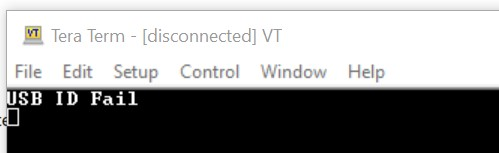
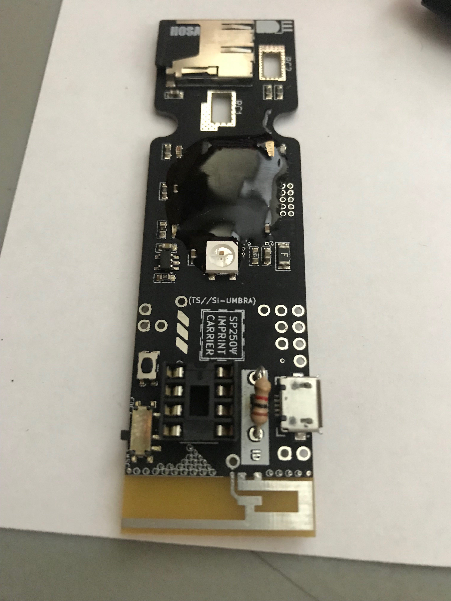
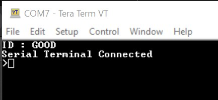
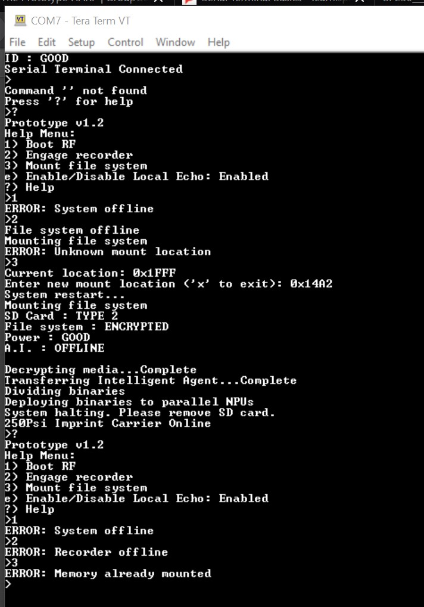

# harp
Group effort to solve the sparkfun HARP v2 puzzle

## First Session 190407-a
1. Downloaded PDF files (in [spec](spec) directory)
2. Connected device to computer and connected via terminal at 9600
3. Got the message "USB ID Fail"

3. Took a snap of the board too with the white LED 

4. Found a reference in one of the documents to adding a resistor to put the device in debug mode [USB ID REV A](spec/SP250___DATASHEET_ERRATA-USB_ID_REV._A_.pdf)
3. Solder a 1k ohm resistor on the device.

4. Reconnected the device to the computer and got a Green LED on the board and this in the terminal:

5. Then this happened:


NOTE: I got the memory address 0x14A2 from the [boot procedure spec sheet](spec/SP250___DATASHEET_ERRATA-BOOT_PROCEDURE__REV._A_.pdf)
6. I then tried a menu item 4, that wasn't on the list: 
```
>4
Can you help me?

5888729431242820303994783011689158023024231308475202328364946839076722787687248841792183757
```

10. Powering off the device doesn't seem to change the state of things.
